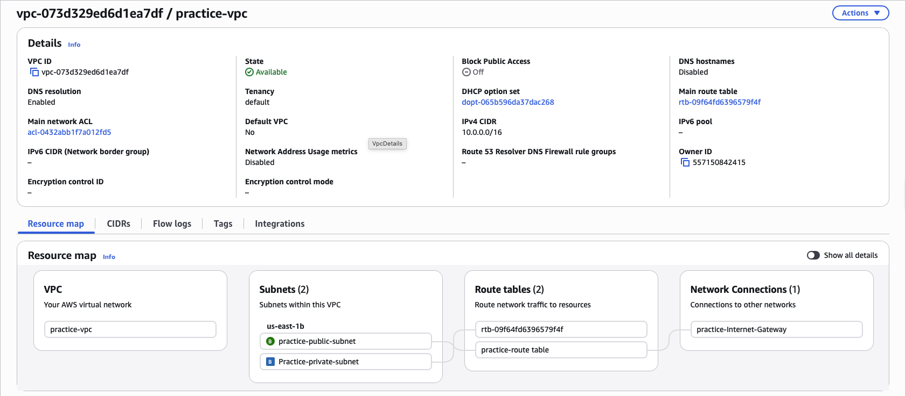
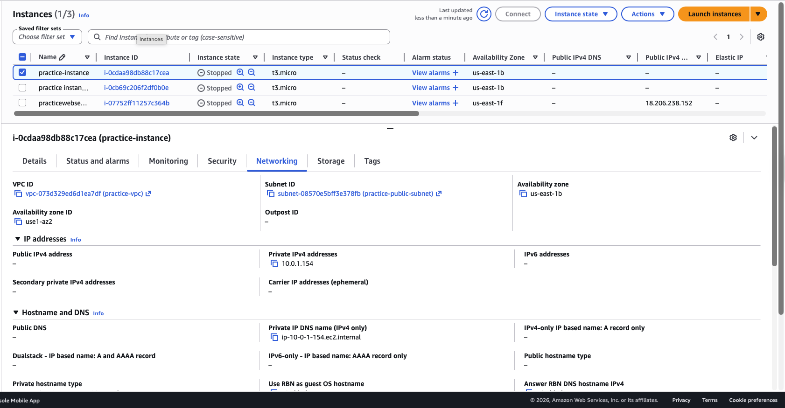
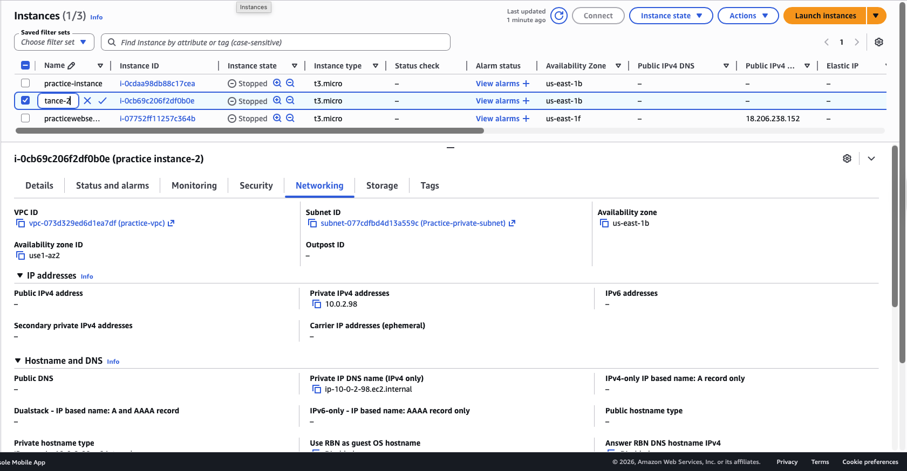

# Lab 1 — VPC and Networking

**Services used:** VPC, Subnets, Internet Gateway, Route Tables, EC2, Security Groups

## Objective

Built a Virtual Private Cloud from scratch with both public and private subnets, then verified that only the public subnet had internet access — reproducing a classic two-tier network architecture.

## What I did

1. **Created a VPC** with CIDR block `10.0.0.0/16` to define the private IP address space.
2. **Created two subnets** in the VPC:
   - Public subnet: `10.0.1.0/24`
   - Private subnet: `10.0.2.0/24`
3. **Created an Internet Gateway** and attached it to the VPC to enable internet connectivity.
4. **Created a custom route table** with a route `0.0.0.0/0 → IGW` and associated it with the public subnet.
5. **Launched an EC2 instance in the public subnet** and verified it could reach the internet (successful `ping` and `yum update`).
6. **Launched an EC2 instance in the private subnet** and confirmed it had no outbound internet access, as expected.

## Screenshots

*VPC created with subnets, route tables and Internet Gateway*

*EC2 instance launched in the public subnet with internet access*

*EC2 instance launched in the private subnet with no internet access*

## Key takeaways

- A VPC is just an isolated network in AWS — the CIDR defines the IP range.
- **A subnet becomes "public" only when its route table points `0.0.0.0/0` to an Internet Gateway.** There's nothing intrinsically public about the subnet itself.
- Private subnets are the default — reaching the internet requires explicit routing.
- Security groups act as stateful firewalls at the instance level, while route tables and NACLs control traffic at the subnet level.
