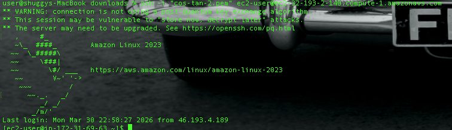
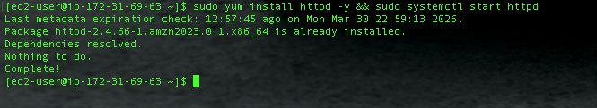
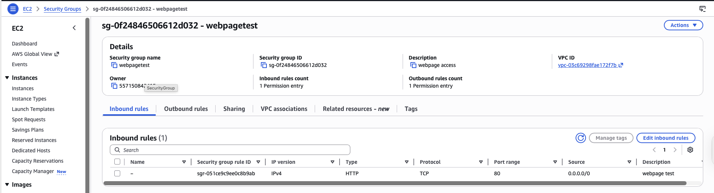
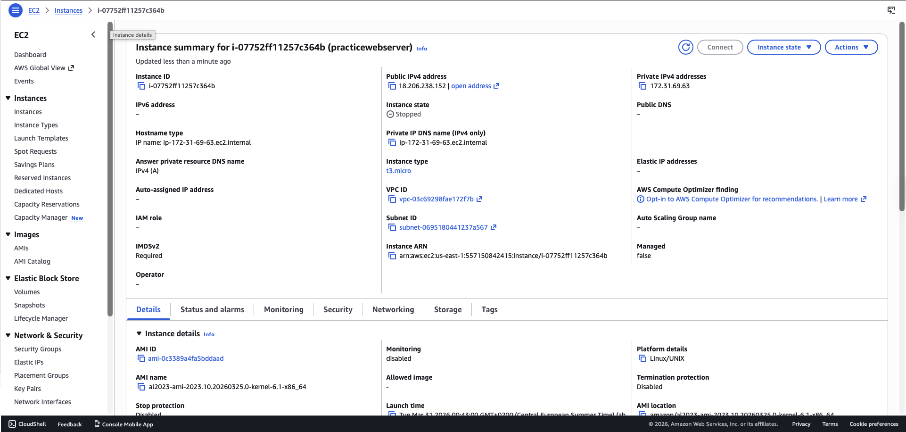

# Lab 2 — EC2 and Security Groups

**Services used:** EC2, Security Groups, SSH, Apache HTTPD

## Objective

Launched an EC2 instance, installed a web server, and demonstrated how security groups act as a virtual firewall by observing the difference in behavior before and after opening port 80.

## What I did

1. **Launched a `t2.micro` EC2 instance** using the Amazon Linux 2 AMI (Free Tier eligible).
2. **Created a key pair** and downloaded the `.pem` file to connect via SSH.
3. **Connected to the instance via SSH** from my local terminal.
4. **Installed and started the Apache HTTP server:**
   ```bash
   sudo yum install httpd -y
   sudo systemctl start httpd
   sudo systemctl enable httpd
   ```
5. **Attempted to reach the web page** via the instance's public IP in a browser — the request timed out because the security group blocked inbound HTTP traffic.
6. **Edited the security group** to add an inbound rule allowing HTTP (port 80) from `0.0.0.0/0`.
7. **Retried the browser request** — the Apache test page loaded successfully.

## Screenshots


*SSH connection to the EC2 instance*


*Apache HTTP server installation on the instance*


*Security group inbound rule allowing HTTP traffic on port 80*


*Apache test page reachable after adding the inbound rule*

## Key takeaways

- **Security groups are stateful** — if inbound traffic is allowed, the response is automatically allowed back out.
- By default, security groups **deny all inbound traffic** and **allow all outbound traffic**.
- The same instance went from unreachable to fully accessible with a single security group rule — no restart needed, changes apply instantly.
- SSH requires port 22 to be open to your IP, which is why it worked from the start (AWS adds that rule by default when you create a key pair during launch).
