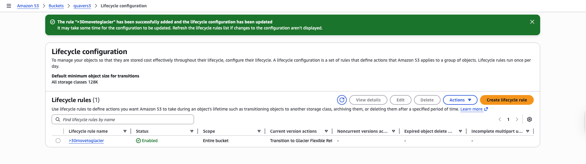

# Lab 3 — S3 Storage

**Services used:** S3, Versioning, Lifecycle Policies, Storage Classes

## Objective

Explored the fundamental features of Amazon S3 — object storage, default privacy, versioning, and lifecycle management — to understand how S3 handles data at scale.

## What I did

1. **Created an S3 bucket** with a globally unique name in the eu-west-3 (Paris) region.
2. **Uploaded a test file** to the bucket.
3. **Tried to access the file via its public URL** — received an `AccessDenied` error, confirming that S3 objects are private by default.
4. **Enabled versioning** on the bucket to preserve historical versions of objects.
5. **Uploaded a modified version of the same file** and verified that both versions were retained and listed under the "Show versions" toggle.
6. **Created a lifecycle rule** to automatically transition objects to Glacier Flexible Retrieval after 30 days, demonstrating automated cost optimization.

## Screenshots

*S3 bucket with a lifecycle rule transitioning objects to Glacier*

## Key takeaways

- **S3 is private by default** — "Block Public Access" is enabled at both the account and bucket level, which is a sensible safety default.
- **Versioning is a powerful protection** against accidental deletion and overwrites, but it also increases storage costs since every version counts.
- **Lifecycle policies are the right way to control cost over time** — moving cold data from S3 Standard → Infrequent Access → Glacier can cut storage costs dramatically.
- Bucket names must be **globally unique across all AWS accounts**, not just within your account.
