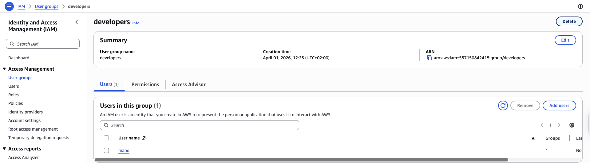
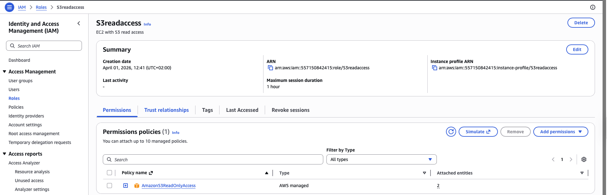
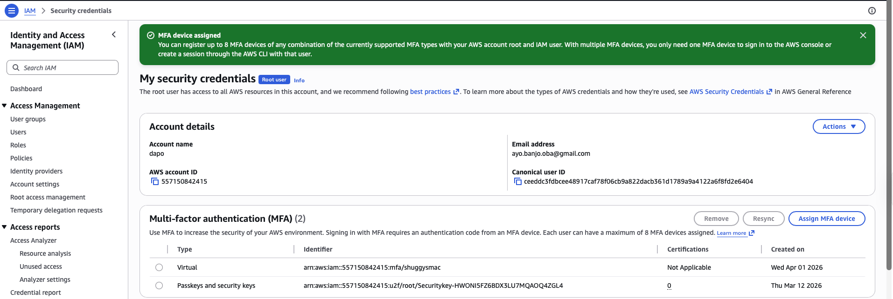

# Lab 4 — IAM: Users, Groups, Policies and Roles

**Services used:** IAM, MFA

## Objective

Put the principle of least privilege into practice by creating an IAM user with restricted permissions, then created a role for EC2 and secured the root account with MFA.

## What I did

1. **Created an IAM user** with console access and a custom password.
2. **Created an IAM group** named `Developers` and attached the managed policy `AmazonS3ReadOnlyAccess`.
3. **Added the user to the `Developers` group**, inheriting the S3 read-only permissions.
4. **Logged in as the new user** in an incognito window to test the effective permissions:
   - Could view S3 buckets and objects
   - Could not launch EC2 instances (received an explicit `AccessDenied` error)
5. **Created an IAM role for EC2** with `AmazonS3ReadOnlyAccess`, which can later be attached to an instance so applications running on it can access S3 without hardcoded credentials.
6. **Enabled MFA on the root account** using a virtual MFA app (Google Authenticator), following AWS best practice.

## Screenshots

*IAM user added to the Developers group with S3 read-only policy*

*IAM role created for EC2 with S3 read-only access*

*MFA enabled on the root account*

## Key takeaways

- **Users vs roles:** users are for humans (long-term credentials), roles are for AWS services or federated identities (temporary credentials). **Roles are always preferred** when possible because they eliminate the need to manage long-lived access keys.
- **Groups simplify permission management** — attaching a policy to a group instead of to individual users scales much better.
- **Least privilege is the #1 IAM principle** — start with zero permissions and grant only what's strictly needed.
- **MFA on the root account is non-negotiable** — the root user has unrestricted access and should be protected accordingly, and only used when absolutely necessary.
