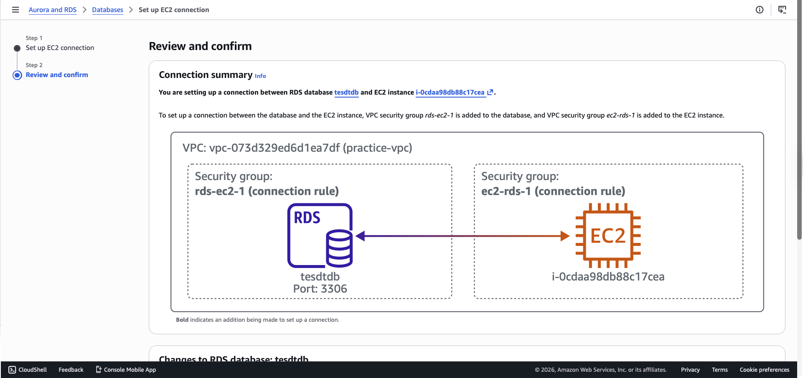

# Lab 5 — RDS Managed Database

**Services used:** RDS, Multi-AZ (observed), Automated Backups, Security Groups

## Objective

Provisioned a managed relational database with Amazon RDS to understand how AWS handles backups, high availability, and security for database workloads.

## What I did

1. **Launched a Free Tier RDS instance** (MySQL, `db.t3.micro`) using the "Free tier" template.
2. **Reviewed the Multi-AZ option** in the console — left it disabled for this lab (Multi-AZ is not Free Tier), but noted where it lives in the configuration.
3. **Checked the automated backup settings**, which were enabled by default with a 7-day retention window.
4. **Observed that RDS automatically created a dedicated security group** for database traffic.
5. **Explored the monitoring tab** to see CPU, storage, and connection metrics provided out of the box.

## Screenshots

*RDS instance connected from an EC2 instance*

## Key takeaways

- **RDS is a managed service** — AWS handles patching, backups, and failure recovery, so there's no OS to maintain.
- **Multi-AZ provides high availability** by maintaining a synchronous standby replica in a different Availability Zone. It's for **availability**, not for read scaling (that's **Read Replicas**).
- **Automated backups are free** up to the size of the database and retained for up to 35 days; manual snapshots persist until explicitly deleted.
- Databases should **never be placed in public subnets** — always in a private subnet, accessed via security groups from application tiers.
