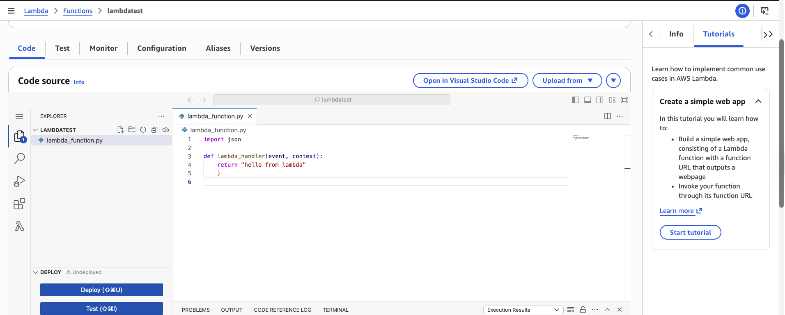

# Lab 6 — Lambda Serverless

**Services used:** AWS Lambda, CloudWatch Logs

## Objective

Built and tested my first serverless function to experience the AWS Lambda execution model — no servers to manage, pay only for what you use.

## What I did

1. **Created a Lambda function from scratch** using the Python 3.12 runtime.
2. **Wrote a simple handler** that returns a greeting:
   ```python
   def lambda_handler(event, context):
       return {
           'statusCode': 200,
           'body': 'Hello from Lambda'
       }
   ```
3. **Tested the function** using the built-in test event feature and confirmed the `200` response.
4. **Opened CloudWatch Logs** and reviewed the log group that was automatically created for the function, where I could see the execution logs, duration, and billed memory.
5. **Reviewed the Lambda pricing model** and noted the generous Free Tier (1M requests and 400,000 GB-seconds of compute per month — always-free, not just the first 12 months).

## Screenshots


*Simple Lambda function created and tested in the console*


*Execution logs automatically captured in CloudWatch*

## Key takeaways

- **Serverless doesn't mean "no servers"** — AWS runs the servers, but I don't see, manage, or patch them.
- **Lambda is event-driven** — it can be triggered by API Gateway, S3 uploads, DynamoDB streams, EventBridge schedules, and many more sources.
- **You pay per invocation and per millisecond of execution time**, rounded to the nearest millisecond. There's no cost when the function is idle.
- **CloudWatch Logs are automatic** — every Lambda function gets a log group created for it by default, which is extremely useful for debugging.
- Lambda is a great fit for glue code, automation tasks, and lightweight APIs, but has limits (max 15 minutes execution, 10 GB memory) that make it unsuitable for long-running workloads.
