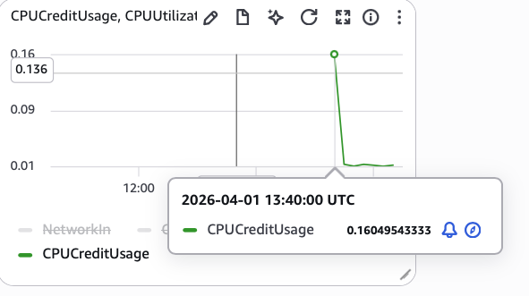
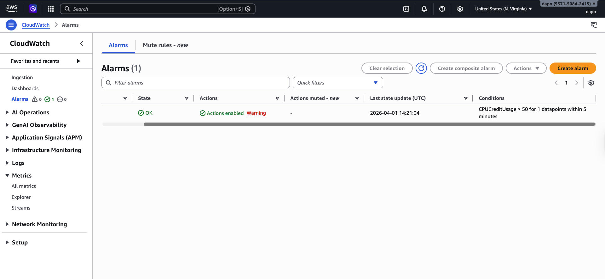

# Lab 7 — CloudWatch Monitoring

**Services used:** CloudWatch Metrics, CloudWatch Alarms, CloudWatch Dashboards, EC2

## Objective

Explored Amazon CloudWatch as AWS's central observability service by collecting EC2 metrics, creating an alarm, and building a simple dashboard.

## What I did

1. **Launched a `t2.micro` EC2 instance** to generate some metrics.
2. **Opened CloudWatch → Metrics** and explored the default EC2 metrics: CPU utilization, network in/out, disk read/write, and status checks.
3. **Created a CloudWatch alarm** to trigger when the instance's CPU utilization exceeded **80%** for two consecutive 5-minute periods, with an email notification through an SNS topic.
4. **Confirmed the SNS email subscription** to start receiving alarm notifications.
5. **Created a CloudWatch Dashboard** with two widgets:
   - CPU utilization line chart
   - Network in/out line chart

## Screenshots

*CloudWatch metric showing EC2 CPU credit usage*

*CloudWatch alarm configured on the CPU credit usage metric*

## Key takeaways

- **CloudWatch is AWS's "central nervous system"** for monitoring — it collects metrics, logs, and events from nearly every AWS service.
- **Basic EC2 metrics are free at 5-minute intervals**; detailed monitoring (1-minute intervals) is a paid feature.
- **Alarms + SNS = a simple but powerful alerting pipeline** that can notify humans or trigger automated remediation (like Auto Scaling or Lambda).
- **Dashboards are per-region by default**, but cross-region dashboards are possible and useful for global workloads.
- CloudWatch does much more than metrics: **CloudWatch Logs** centralizes application logs, and **CloudWatch Events / EventBridge** handles event-driven automation.
